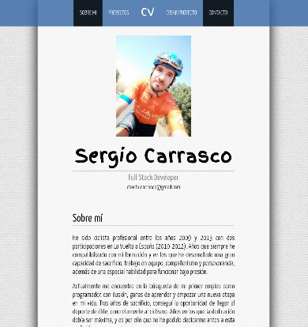

# Portafolio Angular Frontend Responsive

---
## What is Portfolio Angular Frontend Responsive? 🤔

Full MEAN Stack application in conjunction with the 'backend-portfolio-angular' app. We are talking about a Frontend App to show a portfolio and personal resume. It is built in Angular and consumes data from the Api-Rest 'backend-portfolio-angular', which is developed in NodeJS and MongoDB.

## Installation 🔧

After cloning the repository remember to install the node modules:
```
npm install
```
Start app with the command:
```
npm start
```
By default the app runs in: [](http://localhost:4200/).

Remember that you need download be running 'backend-portfolio-angular' for the app runs successfully. You can see how to do it here.

---
## Technologies used 🛠️
- MEAN Stack
- HTML
- CSS
- Angular
- TypeScript
- NodeJS
- MongoDB
- Express
- Robo3T
- Visual Studio Code
- Git/Git Hub
- Postman
- Heroku
---

## Do you want to see the application running? 🚀

Coming soon...

---
## Some working samples ⚙️
## Responsive views - Some examples
#### Desktop view:


---
***

---
***

## Further help

To get more help on the Angular CLI use `ng help` or go check out the [Angular CLI README](https://github.com/angular/angular-cli/blob/master/README.md).

